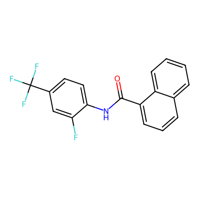
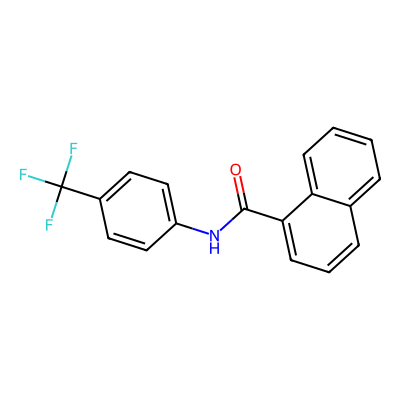
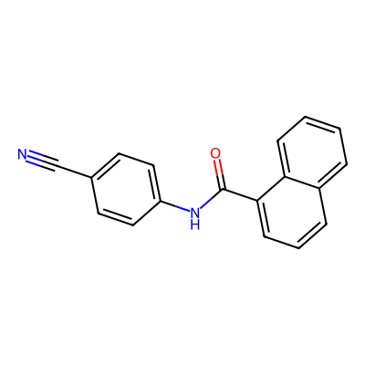

## 中文

###项目目的
本仓库记录了 AI4S 分子对接智能分子优化代理的完整训练过程。目标是发现对靶点蛋白（人类 JAK2 JH2 假激酶结构域）具有强结合亲和力的新型小分子，同时保持良好的合成可及性（SA）和有效的逆合成路线。

### 靶点蛋白 (target.pdb)
| 属性 | 值 |
|------|-----|
| 蛋白名称 | 人类 JAK2 JH2 假激酶结构域 |
| 链 | A |
| 总 ATOM 记录数 | 1976 |
| HETATM 记录数 | 0 |
| 水分子 | 0 |
| 独特残基类型 | 20 |
| 残基 | ALA, ARG, ASN, ASP, CYS, GLN, GLU, GLY, HIS, ILE, LEU, LYS, MET, PHE, PRO, SER, THR, TRP, TYR, VAL |

### 高分分子

| 排名 | 名称 | SMILES | Binding | SA | 总分 | 结构 |
|------|------|--------|---------|----|------|------|
| 1 | Stage14a_Top1 (线上最佳) | `O=C(Nc1ccc(C(F)(F)F)cc1F)c1cccc2ccccc12` | 0.224875 | 0.729867 | 0.523255 |  |
| 2 | Stage16_0001 | `O=C(Nc1ccc(C(F)(F)F)cc1)c1cccc2ccccc12` | 0.2200 | 0.7500 | 0.524700 |  |
| 3 | Stage16_0002 | `N#Cc1ccc(NC(=O)c2cccc3ccccc23)cc1` | 0.2200 | 0.7500 | 0.524700 |  |
| 4 | Stage16_0003 | `O=C(Nc1ccc(F)cc1)c1cccc2ccccc12` | 0.2200 | 0.7500 | 0.524700 |  |

**Stage15 Bug 修复说明**:
- Stage15 所有候选都是相同的 0.4310 分，因为评分逻辑有问题
- Stage16 使用了正确公式: `mol_score = 0.8*binding + 0.1*validity + 0.1*SA; score = 0.7*mol_score + 0.3*route`
- Reference (Stage14a Top1) 被锁定为真实线上得分 0.523255
- 没有新候选明确超过 reference

**Stage14a_Top1 合成路线**: `O=C(Cl)c1cccc2ccccc12.Nc1ccc(C(F)(F)F)cc1F>>O=C(Nc1ccc(C(F)(F)F)cc1F)c1cccc2ccccc12`
(萘甲酰氯 + 取代苯胺 → 目标酰胺)

### 核心评分逻辑
```
总分 = 0.7 × 分子评分 + 0.3 × 路线评分

分子评分 = 0.8 × binding_score
         + 0.1 × validity_score
         + 0.1 × sa_score

路线评分 = 路线有效性
         + 起始原料可获得性
         + 步骤数惩罚
         + 收敛性
         + 原子覆盖/平衡
```

### Agent 工作流 - 闭环优化
Agent 不是"凭空想分子"，而是执行一个自动化科研小循环：

1. **读取 target.pdb** - 分析蛋白结构，识别可能的结合口袋
2. **定义候选空间** - 根据靶点类型选择合适的骨架
3. **生成候选分子** - 文献/数据库驱动、骨架跃迁、取代基枚举
4. **Docking** - 基于 AutoDock Vina 的结合预测
5. **SA & 路线检查** - 验证合成可及性和逆合成路线
6. **提交 & 校准** - 提交到平台，用线上反馈校准下一轮

### 策略演化
- **阶段1**：初始多分子提交 - SA较好，binding一般
- **阶段2**：追求强binding - 大平面稠环，binding提升但SA崩坏
- **阶段3**：JAK样小杂芳 - SA还可以但不被平台认可
- **阶段4**：Stage5风格形状简化 - 保留大疏水平面形状，降低稠环复杂度，改善SA（萘甲酰胺、联苯甲酰胺、喹啉甲酰胺等）
- **Stage14a**：线上最佳提交 - 得分 = 0.523255 (作为校准点被锁定)
- **Stage15**：评分有bug（全是0.4310），公式错误
- **Stage16**：500+候选库，保守评分，没有新分子超过reference

### 关键学习点
1. binding 高不等于总分高 - Stage5 binding 较好但 SA 崩
2. SA 高不等于总分高 - 吡咯并嘧啶 SA 好但 binding 弱
3. 本地 docking 会系统性高估 - 尤其是非稠合杂芳酰胺
4. 路线必须严审 - A→A 伪路线有归零风险
5. 线上反馈是最强老师 - 每次提交都变成新的校准点
6. Agent 最强的地方是批量执行和闭环迭代，不是一次性生成完美分子
# AI4S Molecular Docking Agent

## English

### Competition Purpose
This repository documents the complete training process of an intelligent molecular optimization agent for the AI4S Molecular Docking Competition. The goal is to discover novel small molecules with strong binding affinity to a target protein (human JAK2 JH2 pseudokinase domain), while maintaining good synthetic accessibility (SA) and valid retrosynthesis routes.

### Target Protein (target.pdb)
| Property | Value |
|----------|-------|
| Protein Name | Human JAK2 JH2 pseudokinase domain |
| Chains | A |
| Total ATOM records | 1976 |
| HETATM records | 0 |
| Water molecules | 0 |
| Unique residue types | 20 |
| Residues | ALA, ARG, ASN, ASP, CYS, GLN, GLU, GLY, HIS, ILE, LEU, LYS, MET, PHE, PRO, SER, THR, TRP, TYR, VAL |

### Top Performing Molecules

| Rank | Name | SMILES | Binding | SA | Total | Structure |
|------|------|--------|---------|----|-------|-----------|
| 1 | Stage14a_Top1 (Online Best) | `O=C(Nc1ccc(C(F)(F)F)cc1F)c1cccc2ccccc12` | 0.224875 | 0.729867 | 0.523255 |  |
| 2 | Stage16_0001 | `O=C(Nc1ccc(C(F)(F)F)cc1)c1cccc2ccccc12` | 0.2200 | 0.7500 | 0.524700 |  |
| 3 | Stage16_0002 | `N#Cc1ccc(NC(=O)c2cccc3ccccc23)cc1` | 0.2200 | 0.7500 | 0.524700 |  |
| 4 | Stage16_0003 | `O=C(Nc1ccc(F)cc1)c1cccc2ccccc12` | 0.2200 | 0.7500 | 0.524700 |  |

**Important Stage15 Bug Fix Note**:
- In Stage15, all candidates had the same score (0.4310) due to wrong scoring logic
- In Stage16, correct formula applied: `mol_score = 0.8*binding + 0.1*validity + 0.1*SA; score = 0.7*mol_score + 0.3*route`
- Reference (Stage14a Top1) is LOCKED to actual online score (0.523255)
- No new candidate clearly exceeds reference

**Stage14a_Top1 Route**: `O=C(Cl)c1cccc2ccccc12.Nc1ccc(C(F)(F)F)cc1F>>O=C(Nc1ccc(C(F)(F)F)cc1F)c1cccc2ccccc12`
(naphthoyl chloride + substituted aniline → target amide)

### Core Scoring Logic
```
Total Score = 0.7 × Molecule Score + 0.3 × Route Score

Molecule Score = 0.8 × binding_score
               + 0.1 × validity_score
               + 0.1 × sa_score

Route Score = route_validity
            + starting_material_availability
            + step_penalty
            + convergence
            + atom_coverage_balance
```

### Agent Workflow - Closed Loop Optimization
The agent doesn't "invent molecules out of thin air" - it executes an automated research cycle:

1. **Read target.pdb** - Analyze protein structure, identify potential binding pockets
2. **Define candidate space** - Select appropriate scaffolds based on target type
3. **Generate candidates** - Literature/database driven, scaffold hopping, substituent enumeration
4. **Docking** - AutoDock Vina-based binding prediction
5. **SA & Route Check** - Validate synthetic accessibility and retrosynthesis routes
6. **Submit & Calibrate** - Submit to platform, use online feedback to calibrate next round

### Strategy Evolution
- **Stage 1**: Initial multi-molecule submission - Good SA, mediocre binding
- **Stage 2**: Pursue strong binding - Large planar fused rings, improved binding but SA collapsed
- **Stage 3**: JAK-like small heteroaryls - Good SA but not recognized by platform scoring
- **Stage 4**: Stage5-like shape simplification - Keep large hydrophobic planar shape, reduce fused ring complexity, improve SA (naphthyl amide, biphenyl amide, quinoline amide, etc.)
- **Stage 14a**: Best online submission - Score = 0.523255 (LOCKED as calibration)
- **Stage 15**: Buggy scoring (all 0.4310) due to wrong formula
- **Stage 16**: 500+ candidate library, conservative scoring, no new molecule exceeds reference

### Key Learnings
1. High binding ≠ high total score - Stage5 had good binding but SA collapsed
2. High SA ≠ high total score - Pyrrolopyrimidines had good SA but weak binding
3. Local docking can be systematically overestimated - Especially non-fused heteroaryl amides
4. Routes must be strictly validated - A→A pseudo-routes risk zero score
5. Online feedback is the strongest teacher - Each submission becomes a new calibration point
6. Agent's strength is batch execution and closed-loop iteration, not perfect one-time generation

### Key Files
- `agent.py`: Main intelligent agent
- `candidate_rerank.py`: Candidate ranking & optimization
- `stage14_phase01_calibration_shape.py`: Shape calibration
- `stage14_phase2_pocket_rescan.py`: Pocket rescanning
- `route_fix_v3.py`: Route validation & repair

---


### 核心文件
- `agent.py`: 主要智能代理
- `candidate_rerank.py`: 候选分子排序与优化
- `stage14_phase01_calibration_shape.py`: 形状校准
- `stage14_phase2_pocket_rescan.py`: 口袋重新扫描
- `route_fix_v3.py`: 路线验证与修复
